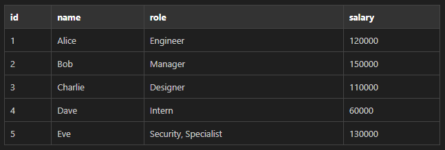

# CSV Formatter

A simple VS Code extension that views CSV files as formatted HTML tables.

[GitHub Repository](https://github.com/pjrigali/csv-formatter)


## Features

- Opens `.csv` files in a readonly custom editor.
- Formats data into a sortable-looking HTML table (sorting implementation pending).
- Handles quoted fields correctly.
- **Color Customization**: Customize header, text, grid, and value colors via the Settings menu.
- **Performance**: Handles large CSV files efficiently using client-side pagination (100 rows per page).

## Sample CSV

The extension includes a `sample.csv` file to demonstrate the formatting:

```csv
id,name,role,salary
1,Alice,Engineer,120000
2,Bob,Manager,150000
3,Charlie,Designer,110000
4,Dave,Intern,60000
5,Eve,"Security, Specialist",130000
```

Turns into:




## Color Customization

Click the **Gear Icon (⚙️)** in the top-right corner of the editor to open the settings panel. You can customize:

- **Header Background**
- **Header Text Color**
- **Grid Lines**
- **Value Text Color**

Changes are saved automatically to your VS Code settings (`settings.json`).